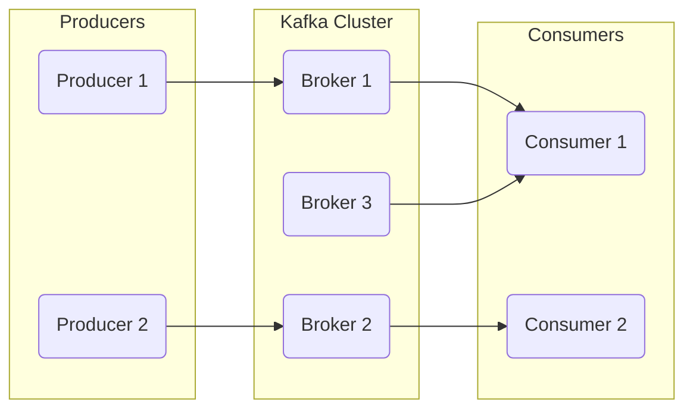

# 1. Introduction to Kafka

This document covers the absolute basics of Kafka. It's the perfect starting point if you're new or need a quick refresher on the "what" and "why."

---

## 🤔 What is Kafka?

Kafka is a **distributed event streaming platform**. Think of it as a super-fast, scalable, and durable logging system for your applications.

*   **Distributed:** It runs as a cluster of servers, making it highly available and fault-tolerant.
*   **Event Streaming:** It allows applications to publish (write) and subscribe to (read) streams of events.
*   **Platform:** It's not just a messaging queue; it provides tools for storage, processing, and integration.

**Analogy:** Imagine Kafka as a central highway for data. "Producer" cars put data onto the highway, and "Consumer" cars read data from it. The highway is divided into lanes (partitions) to handle massive traffic, and it never loses a car.

---

## 🚀 Use Cases of Kafka

*   **Messaging:** Decoupling services in a microservices architecture.
*   **Real-time Data Pipelines:** Moving data between systems (e.g., from your app to a data warehouse).
*   **Log Aggregation:** Collecting logs from multiple services into one central place.
*   **Event Sourcing:** Storing every state change as a sequence of events.
*   **Real-time Analytics:** Processing data as it arrives (e.g., for fraud detection).

---

## 🆚 Kafka vs. Other Message Queues (RabbitMQ, ActiveMQ)

| Feature           | Kafka                                       | RabbitMQ / ActiveMQ (Traditional MQs)      |
| ----------------- | ------------------------------------------- | ------------------------------------------ |
| **Model**         | Pub/Sub (Dumb Broker, Smart Consumer)       | Point-to-Point or Pub/Sub (Smart Broker)   |
| **Data Retention**| Long-term, configurable (days, weeks, etc.) | Short-term (messages deleted after read)   |
| **Scalability**   | Extremely high throughput (millions/sec)    | Moderate throughput                        |
| **Message Replay**| Yes, consumers can re-read messages         | No, messages are typically removed         |
| **Primary Use**   | High-volume event streaming & data pipelines| Traditional task queues & messaging        |

---

## 🏛️ Kafka Architecture Overview

At its core, Kafka's architecture is simple but powerful.

---

## 🔑 Key Terminologies

*   **Topic:** A category or feed name to which events are published. Think of it as a table in a database.
    *   *In our code (`user-service`), we have topics like `user_created_topic`.*

*   **Partition:** A topic is split into multiple logs called partitions. This is how Kafka achieves scalability. Each partition is an ordered, immutable sequence of records.
    *   *More partitions = more parallelism.*

*   **Offset:** A unique, sequential ID given to each message within a partition. Consumers keep track of which offset they have read up to.
    *   *This is how Kafka allows consumers to "rewind" and re-read messages.*

*   **Consumer:** An application that subscribes to (reads) events from one or more topics.

*   **Consumer Group:** A group of consumers that work together to consume a topic. Each partition is consumed by exactly **one** consumer within the group, ensuring that each message is processed only once per group.

---

## 🔁 Revision Corner

### ✅ Quick Summary

*   Kafka is a distributed event streaming platform, like a durable, high-speed log.
*   It decouples services and is used for messaging, data pipelines, and real-time analytics.
*   Unlike traditional MQs, Kafka supports long-term data retention and message replay.
*   Core components are Topics, Partitions, Offsets, Producers, and Consumers.
*   Consumer Groups allow for parallel processing and load balancing.

### 🧠 Interview Questions

1.  **What is Kafka in simple terms?**
    *   It's a publish-subscribe messaging system built for speed, scale, and durability. It acts as a central nervous system for data between applications.

2.  **When would you choose Kafka over RabbitMQ?**
    *   Choose Kafka for high-throughput scenarios (like log aggregation or IoT data), when you need to replay messages, or for building real-time data pipelines. RabbitMQ is better for complex routing and traditional task queues.

3.  **What is a Topic?**
    *   A named stream of records. Producers write to topics, and consumers read from them.

4.  **What is the role of an Offset?**
    *   It's a unique ID for each message in a partition. It allows consumers to track their reading progress and enables message replay.

### 📌 Key Takeaways

*   Kafka is for **streaming**, not just messaging.
*   **Partitions** are the key to parallelism and high throughput.
*   **Offsets** give consumers control over their reading position.
*   Data is **retained** based on policy, not whether it has been read.
*   **Consumer Groups** are how Kafka scales out consumption.
