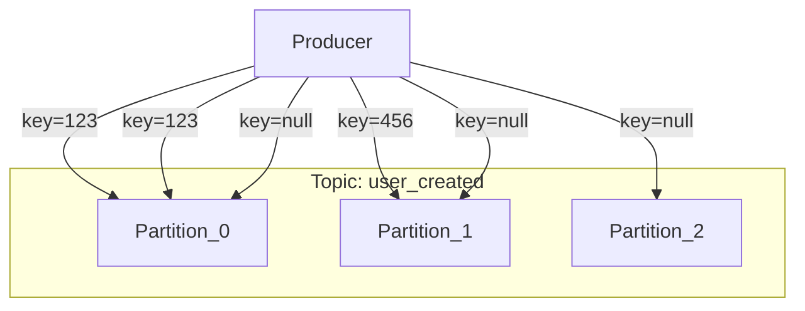

# 2. Apache Kafka Architecture (Deep Dive)

This document explores the core mechanics of Kafka. Understanding this is crucial for debugging, performance tuning, and designing robust systems.

---

## 🧩 Partitioning Logic

A topic is divided into one or more **partitions**. When a producer sends a message, it goes to a specific partition.

*   **How does partitioning work?**
    *   **With a Key:** If you provide a message key (e.g., a `userId`), Kafka uses a hash of the key to decide the partition. `hash(key) % numPartitions`. This guarantees that all messages with the **same key** always go to the **same partition**.
    *   **Without a Key:** If the key is null, Kafka sends messages in a **round-robin** fashion to all partitions to ensure even distribution.



*   **How is message ordering ensured?**
    *   Kafka only guarantees message order **within a single partition**. If you need strict ordering for a set of events (e.g., all events for a specific user), you must use the same key for all those events.

---

## 📖 Reading from Partitions & Consumer Groups

Consumers read data from partitions. To scale consumption, you use a **Consumer Group**.

*   **How it works:**
    1.  You assign multiple consumers to the same `group.id`.
    2.  Kafka assigns each partition to exactly **one** consumer in the group.
    3.  If you have more consumers than partitions, some consumers will be idle.
    4.  If you have more partitions than consumers, a single consumer can read from multiple partitions.

```mermaid
graph TD
    subgraph Topic (4 Partitions)
        P0(Partition 0)
        P1(Partition 1)
        P2(Partition 2)
        P3(Partition 3)
    end

    subgraph Consumer Group A (2 Consumers)
        C1(Consumer 1)
        C2(Consumer 2)
    end

    P0 --> C1;
    P1 --> C1;
    P2 --> C2;
    P3 --> C2;
```

*   **What happens when new consumers are added?**
    *   Kafka triggers a **rebalance**. It stops all consumers in the group, re-assigns partitions among the new set of consumers, and then they resume. This ensures load is distributed.

*   **Can consumers read messages again?**
    *   Yes. A consumer's position is just an **offset** (a number). The consumer can choose to start reading from any offset it wants (e.g., from the beginning of a partition). This is a key difference from traditional message queues.

---

## 🛡️ Partition Replication & Broker Management

Kafka is designed to be fault-tolerant. It achieves this by replicating partitions across multiple brokers.

*   **How it works:**
    *   For each partition, one broker is elected as the **Leader**.
    *   Other brokers become **Followers** and copy the data from the leader.
    *   Producers **only write to the leader**. Consumers **only read from the leader**.
    *   The `replication-factor` determines how many copies of a partition exist. A factor of 3 is common.

*   **What happens when a broker goes down?**
    *   If a broker holding a partition **leader** goes down, one of the **followers** is automatically promoted to be the new leader.
    *   Producers and consumers automatically connect to the new leader. This failover is seamless.

```mermaid
graph LR
    subgraph Broker 1 (Leader for Partition 0)
        L0(P0 Leader)
    end
    subgraph Broker 2 (Follower)
        F0_B2(P0 Follower)
    end
    subgraph Broker 3 (Follower)
        F0_B3(P0 Follower)
    end

    Producer -- "Writes to Leader" --> L0;
    L0 -- "Replicates to Followers" --> F0_B2;
    L0 -- "Replicates to Followers" --> F0_B3;
    Consumer -- "Reads from Leader" --> L0;
```

---

## 📜 Log Retention & Acks

*   **Can messages be read after days?**
    *   Yes. Kafka doesn't delete messages after they are read. It retains them based on a **retention policy**. This can be time-based (`log.retention.hours`) or size-based (`log.retention.bytes`).

*   **Acks and Retries:**
    *   **`acks`**: This producer setting controls how many brokers must confirm a write before it's considered successful.
        *   `acks=0`: Fire and forget. Fastest, but no guarantee.
        *   `acks=1`: Only the leader must confirm. Default. Good balance.
        *   `acks=all`: The leader and all in-sync followers must confirm. Strongest guarantee, but slower.
    *   **Retries**: If a write fails, the producer can be configured to retry automatically. This helps handle transient network issues.

---

## 🔁 Revision Corner

### ✅ Quick Summary

*   **Partitioning** is done via message key (for ordering) or round-robin (for balance).
*   **Consumer Groups** scale reading by assigning partitions to consumers.
*   Adding/removing consumers triggers a **rebalance**.
*   **Replication** (Leader/Follower model) provides fault tolerance.
*   If a leader broker fails, a follower is promoted to leader.
*   **Log Retention** keeps messages for a configured time/size, not based on consumption.
*   **`acks=all`** provides the strongest guarantee that a message is not lost.

### 🧠 Interview Questions

1.  **How does Kafka guarantee message order?**
    *   Only within a single partition. To maintain order for related messages, you must send them all with the same key.

2.  **What is a Consumer Group Rebalance?**
    *   It's the process of re-assigning partitions to consumers within a group. It happens when consumers join or leave the group, or when topic metadata changes. It causes a short pause in consumption.

3.  **What is the role of a partition leader?**
    *   The leader is the single replica responsible for handling all read and write requests for that partition. Followers just copy its data.

4.  **What does `acks=all` mean?**
    *   It means the producer requires confirmation from the partition leader AND all of its in-sync followers before considering a message write successful. This is the safest but slowest option.

### 📌 Key Takeaways

*   Same Key -> Same Partition -> Guaranteed Order.
*   One partition is read by only one consumer *in a group*.
*   Replication is for safety, not for scaling reads (consumers only read from the leader).
*   Kafka's durability comes from its log retention and replication mechanisms.
*   A rebalance is powerful but can pause processing, so avoid frequent consumer changes.
